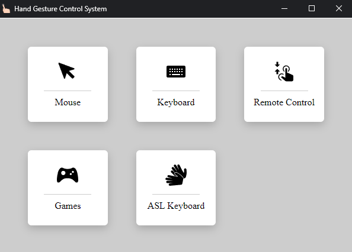

### Gesture-Controlled PC

_Python/ OpenCV/ Mediapipe/ Computer Vision_  
_2022_

A python GUI app with 4 core functions: **virtual mouse, virtual keyboard, virtual remote control, gesture-based games, and sign language keyboard**, where users could apply with their gestures without touching the PC.

This is the group project that I cooperated with classmates during my academic.

---

##### Installation

1. Install Python **3.8.\*** for all users (add path to environment variables).
1. Open command prompt and go to the project folder.
1. Create virtual env: `python -m venv venv`
1. Activate the env: `.\venv\Scripts\activate`
1. Install required packages: `pip install -r req.txt`
1. Run application with below command. `python src/main.py`

That's it.
